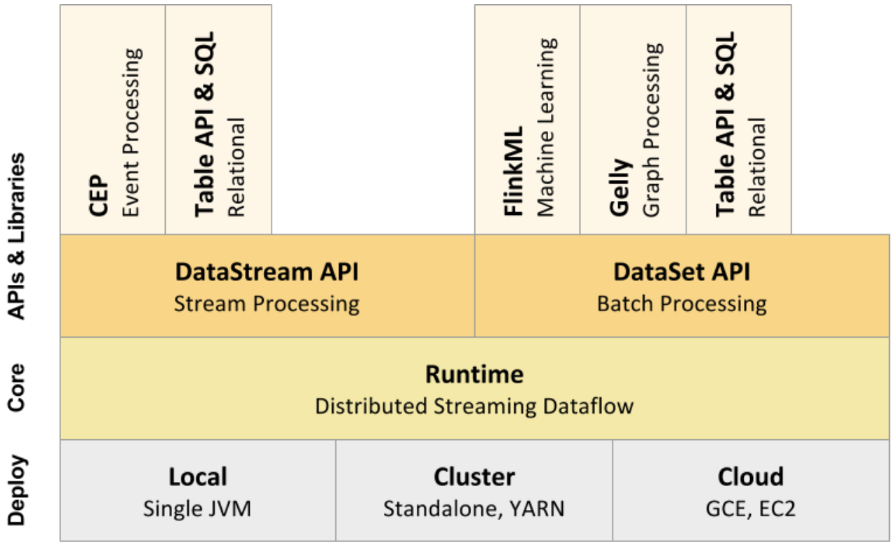
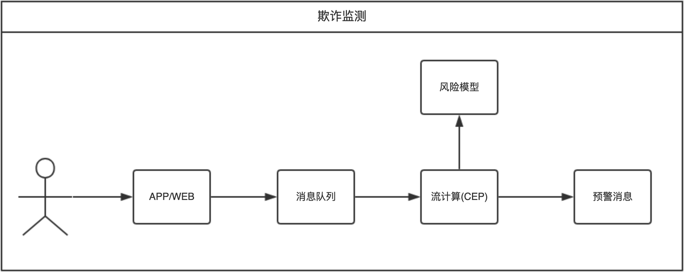

----

* [简单概述](#简单概述)
* [前世今生](#前世今生)
* [核心组件](#核心组件)
* [应用场景](#应用场景)
  * [事件驱动](#事件驱动)
  * [数据分析](#数据分析)
  * [ETL 管道](#ETL\ 管道)
  * [实际案例](#实际案例)
* [同类对比](#同类对比)

----

# 简单概述

>   [Flink](https://flink.apache.org/)是一个分布式大数据处理引擎,可对有限数据流和无限数据流进行有状态计算,可部署在各种集群环境,对各种大小的数据规模进行快速计算

:point_right: Flink既支持流处理也支持批处理,不同的处理方式都支持众多的[输入源](https://github.com/apache/flink/tree/master/flink-connectors)

`Transactions`

交易数据,如电商平台用户下单,数据源源不断写入消息队列,后续Flink处理为用户提供购买相关实时服务​

`Logs`

日志数据,如网站应用的错误日志,源源不断写入消息队列,后续Flink处理为运维部门提供监控依据

`IOT`

物联网数据,如小米手环收集的健康数据,源源不断的写入消息队列,后续Flink处理为用户提供健康报告

`Clicks`

点击流数据,如网站前端会埋点或探针收集用户数据,源源不断的写入消息队列,后续Flink处理为运营提供依据

:point_right: ​Flink数据处理时资源调度可使用[kubernetes](https://kubernetes.io/),YARN,[mesos](http://mesos.apache.org/),数据存储可使用HDFS,S3,NFS等

:point_right: Flink既支持流处理也支持批处理,不同的处理方式都支持众多的[输出源](https://github.com/apache/flink/tree/master/flink-connectors)

# 前世今生

>   2005年基于MapReduce模型实现的Hadoop大火之后,大家纷纷往上迁,但发现流处理解决的并不好,诞生于2009年的Flink直至2015年才因此进入大家的视野,一夜之间成为人尽皆知的流处理引擎

:point_right: 2015年流计算引擎百花齐放,但Flink是最接近DataFlow模型的开源实现,这也许也是阿里巴巴看中其原因​

# 核心组件

:point_right: Deploy层支持本地模式/独立集群/YARN托管/云服务,Core层为DataFlow模型的实现,APIs&​Libraries层为流处理接口和批处理接口以及上层的相关库

# 应用场景

## 事件驱动

>   Event-driven Applications

:point_right: 传统事物应用做法为Events通过Application入库后再从DB中将数据读出,处理结果达到阀值触发Action动作

:point_right: 事件驱动应用​做法为Events可不断写入消息队列,Flink不断从消息队列读取数据,通过窗口在内存中维护一段时间的数据,定期将其同步到持久化存储防止任务数据丢失,处理结果达到阀值触发Action动作同时保存处理结果

## 数据分析

>   Data Analytics Applications

:point_right: ​批处理分析主要用于周期性查询,如涉及数据的日报或周报或者每天凌晨计算前一天数据来供上层领导决策等

:point_right: 流处理分析主要用于连续性查询,如​实时展示双11考拉销售GMV(成交总额),用户下单数据不断写入消息队列,Flink不断读取数据做实时计算并将结果更新至数据库,最终以大屏形式展示

## ETL 管道

>   Data Pipeline Applications

:point_right: ​周期性ETL(提取转换加载),如定期读取传统数据库中的数据,由Flink来做ETL,最终写入数据库或文件系统

:point_right: 数据管道,如Flink不断的从数据库或消息队列读取数据最终追加到数据库或文件系统等数据仓库

## 实际案例

>   电商公司经常搞运营活动但收效甚微,经仔细排查,发现原来是被薅羊毛了,需要做一个实时的异常监测系统,监控用户的高危行为,及时发现高危行为并采取措施,尽快止损

*   用户行为由Web/App上报或被日志记录,将事件发送到消息队列中
*   流计算订阅消息队列,过滤出感兴趣的行为,如购买,领劵,浏览等
*   流计算把这个行为特征化
*   流计算通过CEP跨多条记录分析用户行为整体识别是否有风险
*   综合风险模型和CEP的结果,产生预警信息及时封号或通知运营

# 同类对比

>   Spark和Flink的目标都是在一个系统中支持所有的数据处理以带来性能的提升,目前都支持批处理和流处理

:point_right: Spark相对于Flink流控较差,业务和容错紧耦合,流处理本质上是微批处理(虽然吞吐高但延迟也高),但其在机器学习/图计算方面比较成熟,所以没有谁强谁弱,只有哪个更适合当前的场景

