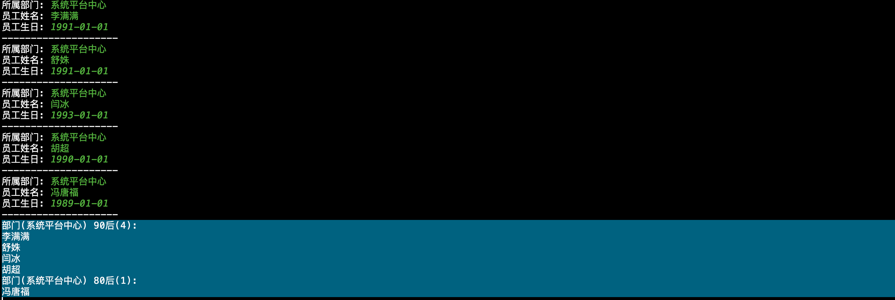

# 本章习题

1.  编写一个脚本, 循环录入员工的部门,姓名和生日最终需要统计每个部门80后,90后人员列表及人数(录入5次)?



```python
#! -*- coding: utf-8 -*-


# compatible print in python3
from __future__ import print_function


# import build-in models
import sys
import platform


# got interpreter version
is_python2 = platform.python_version_tuple() < ('3',)
is_python3 = not is_python2

# compatible input in python2
input = input if is_python3 else raw_input


# coding convert
def _(s, encoding=sys.stdout.encoding):
    # for python3
    if is_python3:
        return s
    # for python2
    if isinstance(s, unicode):
        return s.encode(encoding)
    # utf-8 code that declared at headline
    return s.decode('utf-8').encode(encoding)


if __name__ == '__main__':
    # max cycle times
    count = 1
    # department 80 and 90 staffs
    staff_map = {}

    # start
    while count > 0:
        # got user input
        department = input(_('所属部门: '))
        username = input(_('员工姓名: '))
        birthday = input(_('员工生日: '))
        # print split line
        print('-' * 20)

        # combine department, second digit of birthday as key
        staff_key = (department, birthday[2])
        # append staff_key if not exists
        if staff_key not in staff_map:
            staff_map[staff_key] = []
        # append staff to staff_map[staff_key] if not exists
        if username not in staff_map[staff_key]:
            staff_map[staff_key].append(username)
        # less than one time
        count -= 1

    # foreach department 80 and 90 staffs
    for staff_key in staff_map:  # now staff is (department, 80/90)
        # department 80/90 staff list
        staff_list = staff_map[staff_key]
        # department 80/90 staff number
        staff_num = len(staff_list)
        # filter out not 80 or 90 items
        if '8' not in staff_key and '9' not in staff_key:
            continue
        # format print
        print(_('部门({0}) {1}0后({2}):').format(staff_key[0], staff_key[1], staff_num))
        for staff in staff_list: print(staff)
```

